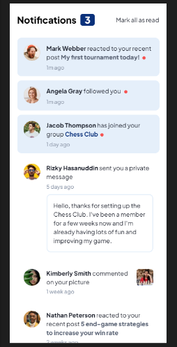

# Frontend Mentor - Notifications page solution

Esta es una solución para [Notifications page challenge on Frontend Mentor](https://www.frontendmentor.io/challenges/notifications-page-DqK5QAmKbC). Frontend Mentor challenges help you improve your coding skills by building realistic projects. 

## Table of contents

  - [The challenge](#the-challenge)
  - [Screenshot](#screenshot)
- [My process](#my-process)
  - [Built with](#built-with)
- [Author](#author)

### The challenge

Los usuarios deben ser capaces de:

- Distinguir entre notificaciones 'no leídas' y 'leídas'
- Seleccione 'Marcar todo como leído' para alternar el estado visual de las notificaciones no leídas y establecer la cantidad de mensajes no leídos en cero
- Ver el diseño óptimo para la interfaz según el tamaño de pantalla de su dispositivo
- Vea los estados de desplazamiento y enfoque para todos los elementos interactivos en la página

### Screenshot

## My process

### Built with

- Semantic HTML5 markup
- CSS custom properties
- Flex
- Mobile-first workflow
- JavaScript

## Author

- Linkedin - [Juan Mosquera](https://www.linkedin.com/in/juanmosquera98/)
- Frontend Mentor - [@yosoyteamc](https://www.frontendmentor.io/profile/Yosoyteamc)
- Instagram - [@yosoyteamc](https://www.instagram.com/yosoyteamc/)
